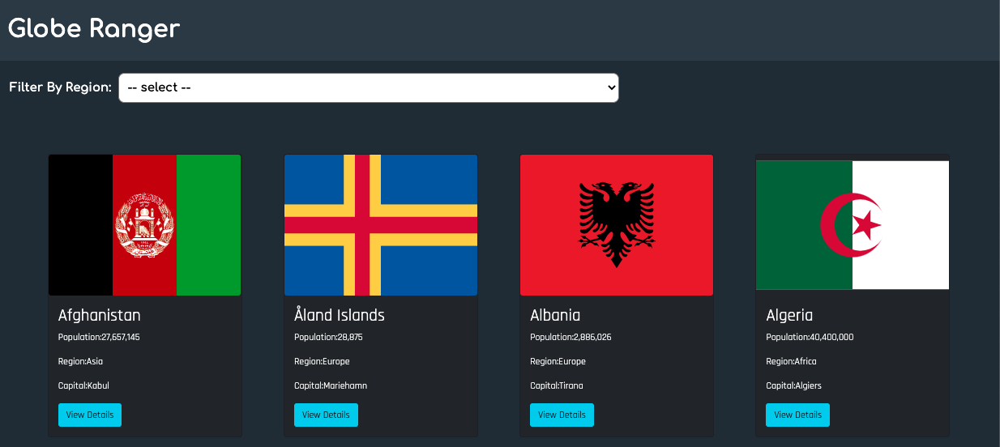

# Globe Ranger- React/Redux Capstone
Building a React and Redux front-end application using the REST countries API service. bootstrapped with [Create React App](https://github.com/facebook/create-react-app). This application uses Routing to traverse between a list of countries and details of a country when it is clicked.

# Live Demo

> Click [here](https://globe-ranger.herokuapp.com/) for live demo



## Built With
- React-redux
- Redux
- Node.js
- React-Create-App
- REST Countries API
- npm
- Heroku
- CSS
- ES6
- jest
- eslint
- style lint

## Getting Started

### Prerequisites
  * Git
  * npm
  * Node.js
  * IDE (Intergrated Development Enviroment)
  * Web Browser

### Steps
- From the command line/terminal clone the repository

```
$ git clone https://github.com/Elbie-em/Globe-Ranger.git
```

**Available Scripts**

cd into the project directory, and you can run:

```
$ npm install

Installs all dependencies
```

```
$ npm start

Runs the app in the development mode.<br />
Open [http://localhost:3000](http://localhost:3000) to view it in the browser.

The page will reload if you make edits.<br />
```

```
$ npm test

Runs all tests
```

## Deployment

Instructions from [Heroku Buildpack](https://github.com/mars/create-react-app-buildpack).

Generate a react app.
replace *$APP_NAME* with the name for your unique app.

```
npx create-react-app@3.x $APP_NAME
```
Create the heroku app.
replace *$APP_NAME* with the name for your unique app.

```
heroku create $APP_NAME --buildpack mars/create-react-app
```

Deploy.

```
git push heroku master
```
Visit the app's public URL in your browser.

```
heroku open
```

## Application features

- The user is able to view all the countries in the world when they load the application.
- The application allows the user to filter the countries by region.
- The user can view detailed information about the country by clicking *view details* .
   
## Author

👤 **Elbie Moonga**

- GitHub: [@Elbie-Em](https://github.com/Elbie-em)
- Twitter: [ElbieEm](https://twitter.com/ElbieEm)
- LinkedIn: [elbie-moonga](https://www.linkedin.com/in/elbiemoonga/) 

## 🤝 Contributing

Contributions, issues and feature requests are welcome!

Feel free to check the [issues page](https://github.com/Elbie-em/Globe-Ranger/issues).

## Show your support

Give a ⭐️ if you like this project!

## Acknowledgments

- [Microverse](microverse.org)
- [REST Countries API](https://restcountries.eu/)

## Learn More

You can learn more in the [Create React App documentation](https://facebook.github.io/create-react-app/docs/getting-started).

To learn React, check out the [React documentation](https://reactjs.org/).

## 📝 License
